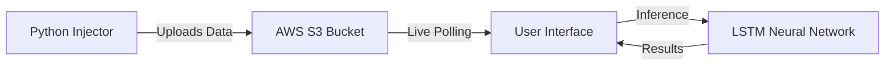

# 🚀 AETHER: Autonomous Earth & Telemetry Heuristic Evaluation & Recognition

<div align="center">

[](https://www.python.org)
[](https://www.tensorflow.org)
[](https://streamlit.io)
[](https://aws.amazon.com/s3/)

**A World-Class, Deep Learning-Powered Mission Control System for Aerospace Telemetry.**

*Designed for precision. Built for scale.*

[View Live Demo](#) • [Report Bug](#) • [Request Feature](#)

</div>

---

## 📖 Project Overview

**AETHER** is a full-stack, cloud-native application that simulates a spacecraft's mission control dashboard. It ingests real-time sensor data via the cloud, processes it through a sophisticated **LSTM (Long Short-Term Memory)** Neural Network, and predicts engine failure trends before they happen.

This project demonstrates the integration of **IoT (Data Injection)**, **Cloud Computing (AWS S3)**, and **Deep Learning** into a cohesive decision-support system.

### 🌟 Key Highlights
- **🧠 Deep Learning Brain:** Uses TensorFlow/Keras LSTM models to understand time-series patterns and predict future engine states.
- **☁️ Cloud Integration:** Seamless data pipeline from Python Injection Scripts to AWS S3, retrieved dynamically by the web dashboard.
- **📊 Real-Time Visualization:** Interactive Plotly graphs showing telemetry trends, historical data, and "Future Horizon" predictions.
- **📄 Automated Reporting:** Generates official PDF incident reports with a single click.
- **🚨 Sentinel Mode:** Automated anomaly detection that triggers alerts when the AI predicts critical thresholds.

---

## 🏗️ System Architecture

The system operates on a **Hybrid Cloud Architecture**:

1.  **Injector (Client-Side):** A Python script (inject_final.py) acts as a spacecraft, generating batch telemetry data and uploading it to AWS S3.
2.  **Storage (Cloud-Side):** AWS S3 (Hyderabad Region) acts as the "Data Lake," storing the latest sensor packets.
3.  **Dashboard (Cloud-Side):** A Streamlit Web App deployed on Streamlit Cloud. It reads from S3, loads the LSTM model, and visualizes the predictions.



---

## 🛠️ Tech Stack

| Category | Technology | Purpose |
| :--- | :--- | :--- |
| **Language** | Python 3.12 | Core Logic |
| **AI/ML** | TensorFlow, Keras, Scikit-Learn | Deep Learning (LSTM) & Preprocessing |
| **Cloud** | AWS S3, Boto3 | Cloud Storage & Data Pipeline |
| **Frontend** | Streamlit, Plotly | Interactive Dashboard & Graphs |
| **Utilities** | Pandas, NumPy, FPDF | Data Manipulation & Reporting |

---

## 🚀 Getting Started

To run this project locally, you need Python installed and an AWS Free Tier account.

### Prerequisites
1.  **AWS Account:** Create an AWS Free Tier account.
2.  **Python:** Install Python 3.12 or higher.
3.  **Git:** Install Git to clone the repo.

### Installation

1.  **Clone the Repository:**
    ```bash
    git clone https://github.com/YOUR_USERNAME/aether-system.git
    cd aether-system
    ```

2.  **Create Virtual Environment:**
    ```bash
    python -m venv venv
    # Windows
    venv\Scripts\activate
    # Mac/Linux
    source venv/bin/activate
    ```

3.  **Install Dependencies:**
    ```bash
    pip install -r requirements.txt
    ```

4.  **Configure AWS Credentials:**
    *   Go to AWS Console -> IAM -> Users -> Create User.
    *   Grant `AmazonS3FullAccess`.
    *   Generate **Access Keys**.
    *   Configure your local CLI:
        ```bash
        aws configure
        # Enter your keys
        # Default Region: ap-south-2 (Hyderabad)
        ```

5.  **Update Configuration:**
    *   Open `inject_final.py` and `app.py`.
    *   Change `BUCKET_NAME` to your specific AWS S3 bucket name.

---

## 🖥️ Usage

You need **two** terminal windows to simulate the full mission.

### Terminal 1: The Spacecraft (Data Injector)
This script acts as the satellite, sending data every 5 seconds.

```bash
python inject_final.py
```
*You should see: "Packet Sent. Latest Temp: 105.2°C"*

### Terminal 2: Mission Control (Dashboard)
Launches the web application.

```bash
streamlit run app.py
```
*Open your browser at `http://localhost:8501` to view the dashboard.*

---


## 🤝 Contributing

Contributions are what make the open-source community such an amazing place to learn, inspire, and create. Any contributions you make are **greatly appreciated**.

1.  Fork the Project
2.  Create your Feature Branch (`git checkout -b feature/AmazingFeature`)
3.  Commit your Changes (`git commit -m 'Add some AmazingFeature'`)
4.  Push to the Branch (`git push origin feature/AmazingFeature`)
5.  Open a Pull Request

---

## 📜 License

Distributed under the MIT License. See `LICENSE` for more information.

---

## 👨‍💻 Author

**Smacky's Bro (You)**

*   **Project:** AETHER System
*   **Email:** [Your Email]
*   **LinkedIn:** [Your LinkedIn Profile]

---

<div align="center">

**Built with ❤️ for Space & AI**

"From a laptop to the Cloud."

</div>