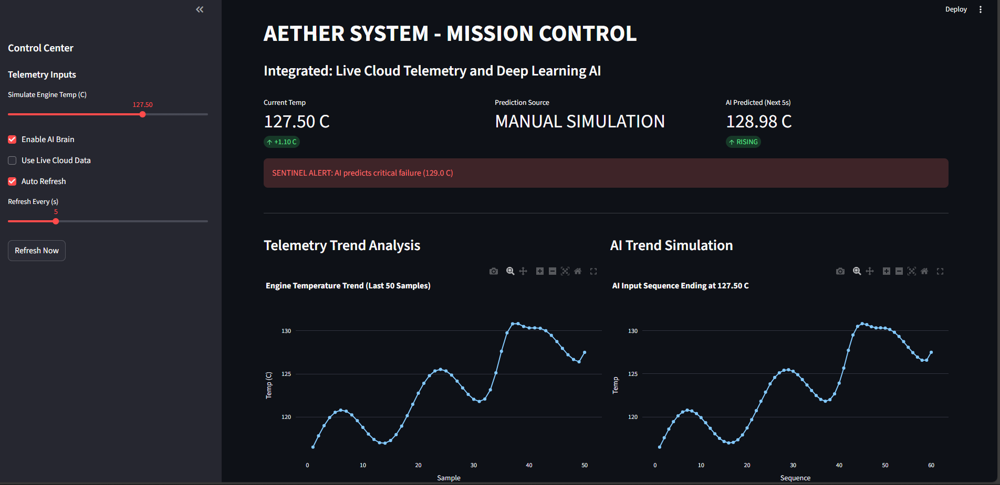

# Aether System - Mission Control 🚀

**AETHER SYSTEM - MISSION CONTROL** is a Streamlit-based web application integrated with Live Cloud Telemetry and a Deep Learning AI Brain (LSTM model built with TensorFlow/Keras). It acts as a mission control dashboard to monitor engine temperatures, simulate telemetry, and predict critical failures in real-time.



## Features

* **Real-time Telemetry Dashboard**: Monitor historical and live engine temperature data. Visualizations are powered by Plotly.
* **Live Cloud Integration**: Fetch live telemetry data directly from AWS S3 buckets.
* **Deep Learning Prediction (AI Brain)**: 
  * Powered by an LSTM model (`aether_brain_v2.h5`).
  * Predicts the engine temperature for the next 5 seconds horizon.
  * Displays "SENTINEL ALERT" if a critical engine failure is predicted (temperature > 120°C).
* **Mission Reporting**: Automatically generates and allows downloading of a mission report in PDF format capturing current live data and AI predictions.
* **Manual Simulation**: Ability to manually simulate engine temperatures and telemetry data when cloud signal is unavailable.

## Project Structure

* `app.py`: Main Streamlit application script containing the dashboard and logic.
* `aether_brain_v2.h5`: Pre-trained Keras AI model for temperature predictions.
* `scaler.pkl`: Scikit-learn scaler used for data normalization.
* `requirements.txt`: Python package dependencies for the project.

## Installation & Setup

1. **Clone the repository:**
   ```bash
   git clone https://github.com/Ranjith01111/aether-system.git
   cd aether-system
   ```

2. **Create and activate a virtual environment (optional but recommended):**
   ```bash
   python -m venv venv
   # on Windows use:
   venv\Scripts\activate
   # on macOS/Linux use:
   source venv/bin/activate
   ```

3. **Install dependencies:**
   ```bash
   pip install -r requirements.txt
   ```

4. **Configure Secrets (Optional for Live Data):**
   To use the Live Cloud Telemetry, configure AWS credentials in Streamlit's `secrets.toml` file (`.streamlit/secrets.toml`):
   ```toml
   AWS_ACCESS_KEY_ID = "your_access_key"
   AWS_SECRET_ACCESS_KEY = "your_secret_key"
   ```

## Running the Application

Execute the following command to start the Streamlit server:

```bash
streamlit run app.py
```

Open the provided local URL (typically `http://localhost:8501`) in your web browser.

## Technologies Used

* **Python 3**
* **Streamlit**: Web Dashboard Framework
* **TensorFlow/Keras**: AI Model Toolkit
* **AWS boto3**: S3 Cloud Data fetching
* **Pandas & NumPy**: Data processing and manipulation
* **Plotly**: Real-time Interactive graphs
* **FPDF**: Mission report generation
